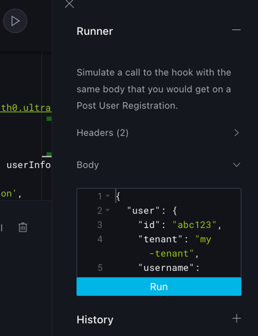
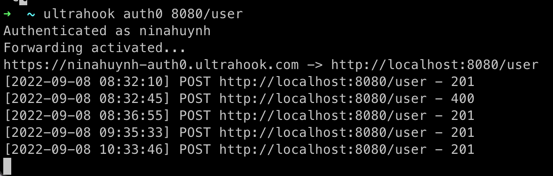

## Description

This application uses NestJS framework along with TypeORM and PostgreSQL for database implementation.

## Pre-installation
Please make sure that you installed PostgreSQL before running the app. In the .env please fill out all the required configurations for database connection.
Example:

```bash
NEST_APP_AUTH0_DOMAIN=dev-elws5e13.us.auth0.com
NEST_APP_AUTH0_CLIENT_ID=sydQIoZtakHrJ9b4dvfzWyCs2ZGWwFzs
NEST_APP_AUTH0_AUDIENCE=http://localhost:8000/api/validate-token
NEST_APP_AUTH0_SECRET=RS256
NEST_APP_AUTH0_ISSUE_URL=https://dev-elws5e13.us.auth0.com/
NEST_APP_AUTH0_AUDIENCE=http://localhost:3000
DEVELOPEMENT_STAGE=dev
TOKEN_EXPIRE_TIME=5000000000000000s
BASE_URL=http://localhost:8080

PORT=8080
BASE_URL=localhost:8080
CLIENT_BASE_URL=localhost:3000
UPLOAD_API_KEY=93e0edd4fa1760adf671cc2805eeb5ff
DATABASE_HOST=localhost
DATABASE_NAME=1car
DATABASE_USER=postgres
DATABASE_PASSWORD=admin
DATABASE_PORT=5432

STRIPE_SECRET_KEY=sk_test_51LZcoyKdTNhAxbgQLZxYRaHpgvOrU9R6AAMpriCTWskay8zV0JNSbVqDKrOFDNf4onQZNxdsL6B7fUHjwsUijUnH00bYI1i3B1
STRIPE_INTENT_WEBHOOK_SIG_KEY=whsec_7qryncD9gTfGE1v3UZW0aYDxuSyGQ5BX

EMAIL_FIELD_NAME=https://example.com/email
```

## Installation

```bash
$ npm install
```

## Running the app

```bash
# development
$ npm run start

# watch mode
$ npm run start:dev

# production mode
$ npm run start:prod
```

## Test

```bash
# unit tests
$ npm run test

# e2e tests
$ npm run test:e2e

# test coverage
$ npm run test:cov
```

# Integrate with Auth0

I config ultrahook to work with Auth0 post registration hook.
When sign up using Auth0 universal login successfully, it will send info to the below endpoint.

The api key: HPVB6Nap29id7WFMSagiLYCekexfKEcQ

The post registration will hit https://ninahuynh-auth0.ultrahook.com.
This will proxy to http://localhost:8080, our backend app.

## Get started with ultrahook

Save the Api key:
```echo "api_key: HPVB6Nap29id7WFMSagiLYCekexfKEcQ" > ~/.ultrahook```

And install the UltraHook client:
```gem install ultrahook```

Start by running ```ultrahook auth0 8080/user```

Add your link into hooks code urlArray and save
it [Auth0 hooks](https://manage.auth0.com/dashboard/us/dev-elws5e13/hooks)


Test and run by using Runner and see if the request is made successfully or not by checking the terminal



